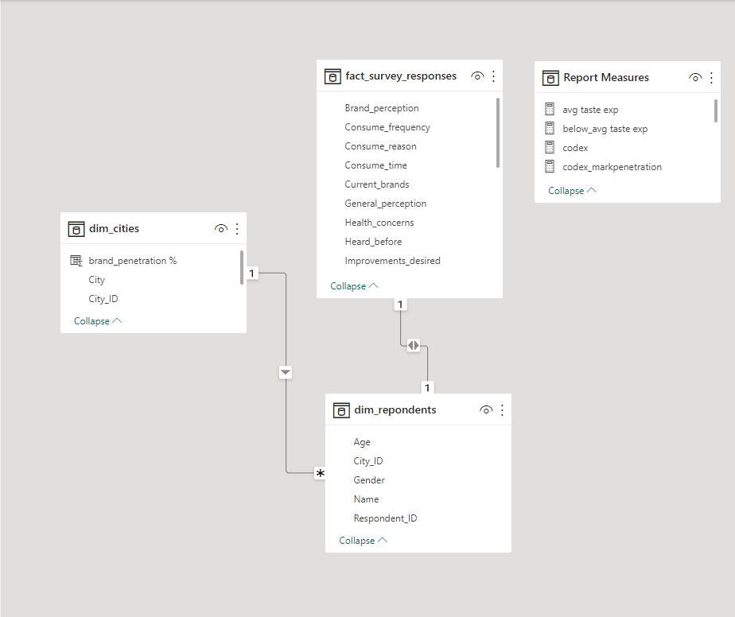

# CodeX-Market-Survey-Analysis

## This project is done as entry to Codebasics Resume Challenge 6 - Provide Insights to the Marketing Team in Food & Beverage Industry

### Problem statement

CodeX is a German beverage company that is aiming to make its mark in the Indian market. A few months ago, they launched their energy drink in 10 cities in India.
Their Marketing team is responsible for increasing brand awareness, market share, and product development.
They conducted a survey in those 10 cities and received results from 10k respondents.
Peter Pandey, a marketing data analyst is tasked to convert these survey results to meaningful insights which the team can use to drive actions.

### Task

Check the “Primary_Secondary_Insights.pdf” and answer the questions by analyzing the data provided. You can use any tool of your choice (Python, SQL, PowerBI, Tableau, Excel, PowerPoint).
You can add more research questions and answer them in your presentation that suits your recommendations.
The target audience is the Chief Marketing Officer, you have 15 minutes to present insights to him. Make a concise presentation.
Be creative with your presentation, audio/video presentation will have more weightage.
You can use additional data based on your own research to support your recommendations
Please note that it is possible that some respondents might not have answered all the questions sincerely.
For instance, a person is more likely to have not tasted the drink if they haven’t heard about it. Sense-check the data and use your judgment to clean it as required.

## Data Model created:

## [Canva Presentation Slides] (https://www.canva.com/design/DAFnRe7idKQ/COOkFI36muRPovbqSVCfSg/view#10)

https://www.canva.com/design/DAFnRe7idKQ/COOkFI36muRPovbqSVCfSg/view#10

##### Learning outcomes from this project:
<ol>
  <li>Data loading in Power BI</li>
  <li>Data Cleaning in Power Query Editor</li>
  <li>Creating DAX Calculated Columns</li>
  <li>Creating various measures essential for visual creation</li>
  <li>Using Microsoft Power BI effectively to create different types of visuals</li>
  <li>How the filters work across different visuals and how to edit interactions with visuals</li>
  <li>How to add hyperlinks in Power BI report page</li>
</ol>

###### Insights from the dashboard:
<ol>
  <li>Looking at weekday and weekend comparion for key metrics, the RevPAR and ADR show no major difference. This shows that differential pricing strategy       is not being considered.</li>
  <li> Booking by Platform analysis and DRR % Trend show that direct booking channels of the hotels are attracting comparatively low bookings</li>
  <li>When compared by City, Mumbai is generating the highest revenue whereas Hydrabad is generating the lowest revenue.</li>
  <li>Atliq Exotica is generating the highest revenue whereas Atliq Grand is generating the lowest revenue</li>
  <li>Realisation % for both Tripster and Makeyourtrip Platforms are low compared to others</li>
</ol> 
